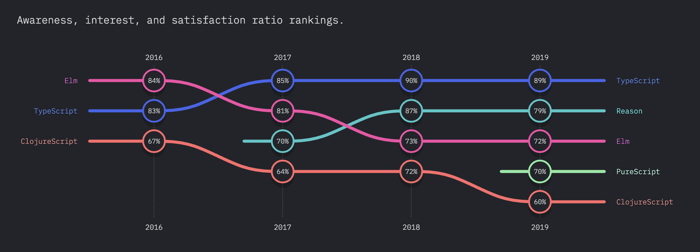
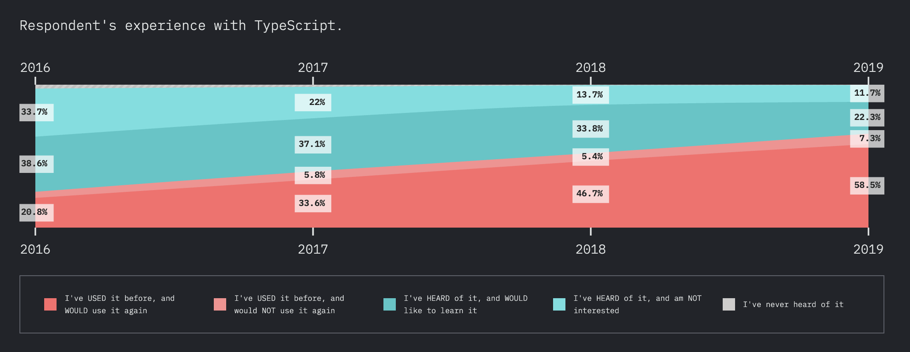

This was the question I started asking myself about 6 months ago. JavaScript works - pretty well in fact. For whatever reason though, it still felt like something was missing.

Three long years ago I joined a 3 person startup as the first technical hire and was tasked with creating the company web application. After evaluating AngularJS, ReactJS and VueJS, I decided to build the proof-of-concept with [ReactJS](https://reactjs.org/) and [TypeScript](https://www.typescriptlang.org/). It didn't go so well.

<!--truncate-->

I fought through the learning curve of React & TS while struggling with types and missing type definitions for some of the dependencies. I eventually made it work but as a new company we wanted to move fast. The conclusion: TypeScript in a vacuum is great, but not in a React app. At the time I felt that it would slow us down more than it would help us and so I spent the following weekend after completion converting it to JavaScript.

Now fast forward 2.5 years and here I am debating if the company should migrate the 3 front end applications and 6 internal npm packages to TS. Why the change of heart? The application and company had grown in size, like considerably. I no longer knew exactly who wrote every single line of code (git blame ftw). The application handles complex websocket logic, continuously changing business logic and rapid changes to API schemas as we iterate on the product. What I once thought was unnecessary, I now began to consider using in order to help us scale. In those 2.5 years TS evolved immensly and so did the support for it within the npm ecosystem. The [DefinitelyTyped](https://github.com/DefinitelyTyped/DefinitelyTyped) github repository grew substantially and solved some of the external lib typing issues we once faced. After a couple days of due diligence, I decided to go for it.

Was is it worth the headache-inducing process of migrating? For a new project, is it worth learning? Let's discuss - but first:

### What is TypeScript?
TypeScript is a project out of Microsoft developed by the same people that created C#. It's an open-source project that now has 65K stars on [GitHub](https://github.com/microsoft/TypeScript/) with 500+ collaborators and immense support. At a high level, the TypeScript programming language is a structural, strongly and **gradually** typed superset of JavaScript. It complies down the JavaScript and interops with JavaScript files.

```javascript
const add = (a, b) => a + b;
```
could simply become
```javascript
const add: number = (a: number, b: number) => a + b;
```
I say __could__ because the first example would be sufficient for TypeScript. This is why it was described as gradually typed above - a key flexibility when migrating.

### Who is using it?
This was the first thing I began to research before pitching the idea of migrating to TS to the company. It appears Microsoft, Google, Slack, Medium, Asana, Intuit, Cloudflare, Circle, Lyft, AirBnB and more are also on the TypeScript train.. not bad company (no pun).

I found these two blog posts very persuasive:
[Lyft Blog](https://eng.lyft.com/typescript-at-lyft-64f0702346ea)
[Asana Blog](https://blog.asana.com/2014/11/asana-switching-typescript)

### Are there other options to consider?
Every year TS comes up as one of the most loved programming language on Stack Overflow's yearly survey. This year, the 2020 survey had this to say:
>
After a consistent rise over the last five years, Python fell from second last year to third this year on the list of most loved technologies, being beat out by TypeScript. Rust held the top spot for most loved technology for the fifth year in a row.

The developer backing for TS is there. But what else is out there? I found this graph on the [stateofjs](https://2019.stateofjs.com/javascript-flavors/typescript/) survey (21,717 respondents) supported the fact that TS was the right direction and in fact, the rest of the JS world also felt similar. After slight consideration for the rest, it was back to why TS.




### So what EXACTLY are the benefits?
1) **Readability**
By using TS, one can greatly increase the readability of their code and likely make it easier for anyone that may not be familiar with the code base. It scales across engineers as the type system is explicit and self-documents itself and removes the need for JSDocs.

2) **Regression-safety**
TS scales across the code base by having static types notify what else will break and type-safety across files. This is incredibly important at scale when making changes. Regression-safety is key.

3) **Incremental opt-in and backwards compatibility**
TS allows for the benefits of TS to slowly be adopted without causing issues with existing code.

4) **Lower cognitive load**
I often found that reading someone elses JavaScript wouldn't paint a clear picture in my head. A function taking a set of parameters were simple thing1, thing2 and thing3. It was not immediately obvious what each parameter was and their type/shape were not instantaneously mapped in my head. TypeScript lowers the cognitive load required when reading code by other engineers.

5) **Errors at compile time not runtime!**
`Uncaught TypeError: Cannot read property "foo" of undefined` is one of the most common JavaScript errors. It occurs when accessing properties of a reference that could possibly be undefined. Since TS has to be compiled down to JS, scenarios like this and any more can be caught ahead of time.

6) **Code completion/Hints**
Although not a game-changer, this is a small quality of life upgrade that helps create a better developer experience for all.

### Migration
Unfortunately, a lot of projects are not written in TS from inception and must go through a migration process if they want to obtain the benefits of TS. In an effort to not re-explain what AirBnB did so eloquently [here](https://2019.stateofjs.com/javascript-flavors/typescript/), I will say you should read about their migration process and recommend using the `ts-migrate` package they built. It made migrating a code base to TS a far less painful process. Much better than by hand, I can attest :)

### OOP Background?
If your backend is written C#/.NET Core or is part of the .NET family, then you'll feel at home. It was created by the same people, and you'll get the benefit of both worlds - the flexibility and functional aspects of JS with the ability to be strongly-typed. I like to joke that it's like C# and JS had a baby. Regardless of the OOP language you are coming from, TS can be a nice transitional bridge into JavaScript.


My experiences are my experiences and they were pleasant. I have read the counterarguments but to each their own. I would love to hear from someone who did not have a great experience with TS either on the front or backend or someone who found other ways to extract the benefits of TS in their codebase.

### Moral
Because you decide to not use something, doesn't make it a wrong move. It simply means it was not the correct decision *at that time*. Revisiting and reevaluation past decisions in the future can potentially lead to a positive outcomes.
