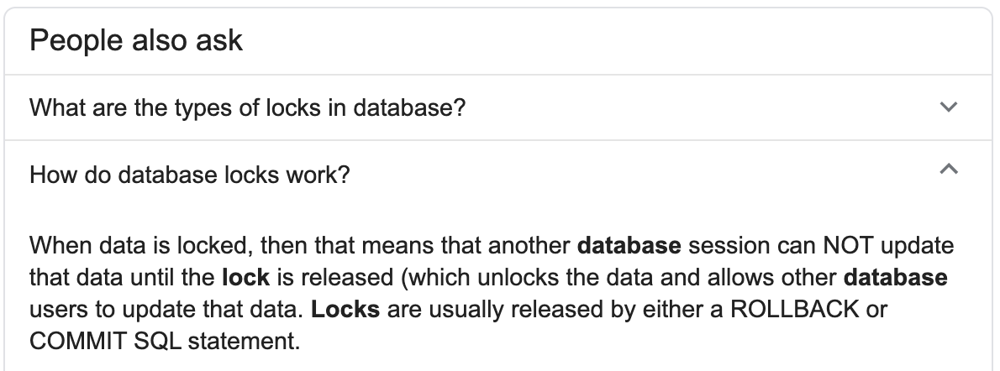

When it comes to non-relational databases, the consistency models of the data can be significantly different than found in relation databases or even different among different non-relation databases. When analyzing data in databases, there are two common consistency models used - ACID and BASE. So what are they and which do they apply to?

## ACID Consistency Model
The ACID consistency model is often brought up when working with **relational databases** as it is the bread and butter for SQL databases. Following ACID can provide a way to have a safe database environment to transact and operate on the data. The acronym means the following:

### Atomic
All operations complete successfully or none no data changes are made (Rollback)
### Consistent
After transaction is complete, data is in valid state (no validation rules broken)
### Isolated
Result of transaction operations are equivalent calling operations sequentially (DBs often don’t run these operations sequentially for optimization reasons, but the end result must be equivalent as if it did)
### Durable
Results of transaction are permanently stored at end of successful transaction

##

ACID properties mean that once a transaction is completed, the database data is consistent/stable on disk.

Write consistency is very important for transactions and engineers but require locking in order to be conducted properly. Possible future article on this - for now see what Google says.

## BASE Consistency Model:
* Basic Availability: The database works most of the time
* Soft-state: The nodes don’t have to be constantly consistent, data variation can occur across nodes
* Eventual consistency: Stores exhibit consistency at some later point