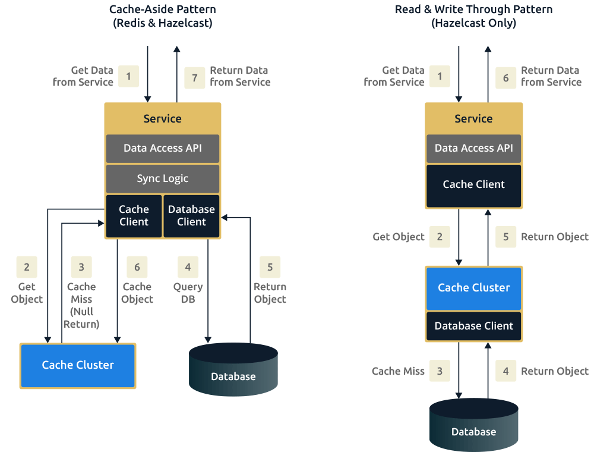

Caches take advantage of the locality of reference principle: recently requested data is likely to be requested again. They are used in almost every layer of computing: hardware, operating systems, web browsers, web applications, and more.

### Overview
A cache is like short-term memory: it has a limited amount of space, but is typically faster than the original data source and contains the most recently accessed items. Caches can exist at all levels in architecture, but are often found at the level nearest to the front end where they are implemented to return data quickly without taxing downstream levels.

In practice, caching is important earlier in the development process than load-balancing, and starting with a consistent caching strategy will save you time later on. It also ensures you don’t optimize access patterns which can’t be replicated with your caching mechanism or access patterns where performance becomes unimportant after the addition of caching (I’ve found that many heavily optimized  [Cassandra](http://cassandra.apache.org/)  applications are a challenge to cleanly add caching to if/when the database’s caching strategy can’t be applied to your access patterns, as the datamodel is generally inconsistent between the Cassandra and your cache).

### Application Server Cache
Placing a cache directly on a request layer node enables the local storage of response data. Each time a request is made to the service, the node will quickly return local cached data if it exists. If it is not in the cache, the requesting node will query the data from disk. The cache on one request layer node could also be located both in memory (which is very fast) and on the node’s local disk (faster than going to network storage).

What happens when you expand this to many nodes? If the request layer is expanded to multiple nodes, it’s still quite possible to have each node host its own cache. However, if your load balancer randomly distributes requests across the nodes, the same request will go to different nodes, thus increasing cache misses. Two choices for overcoming this hurdle are global caches and distributed caches.

### Cache Invalidation
While caching is fantastic, it does require some maintenance for keeping cache coherent with the source of truth (e.g., database). If the data is modified in the database, it should be invalidated in the cache; if not, this can cause inconsistent application behavior.
Solving this problem is known as cache invalidation; there are three main schemes that are used:

**Write-through cache:** Under this scheme, data is written into the cache and the corresponding database at the same time. The cached data allows for fast retrieval and, since the same data gets written in the permanent storage, we will have complete data consistency between the cache and the storage. Also, this scheme ensures that nothing will get lost in case of a crash, power failure, or other system disruptions.

Although, write through minimizes the risk of data loss, since every write operation must be done twice before returning success to the client, this scheme has the disadvantage of higher latency for write operations.

**Write-around cache:** This technique is similar to write through cache, but data is written directly to permanent storage, bypassing the cache. This can reduce the cache being flooded with write operations that will not subsequently be re-read, but has the disadvantage that a read request for recently written data will create a “cache miss” and must be read from slower back-end storage and experience higher latency.

**Write-back cache:** Under this scheme, data is written to cache alone and completion is immediately confirmed to the client. The write to the permanent storage is done after specified intervals or under certain conditions. This results in low latency and high throughput for write-intensive applications, however, this speed comes with the risk of data loss in case of a crash or other adverse event because the only copy of the written data is in the cache.

Cache-Aside below (left) is referencing the *write-around* cache mechanism.

## Cache eviction policies
Following are some of the most common cache eviction policies:
1. First In First Out (FIFO): The cache evicts the first block accessed first without any regard to how often or how many times it was accessed before.
2. Last In First Out (LIFO): The cache evicts the block accessed most recently first without any regard to how often or how many times it was accessed before.
3. Least Recently Used (LRU): Discards the least recently used items first.
4. Most Recently Used (MRU): Discards, in contrast to LRU, the most recently used items first.
5. Least Frequently Used (LFU): Counts how often an item is needed. Those that are used least often are discarded first.
6. Random Replacement (RR): Randomly selects a candidate item and discards it to make space when necessary.

