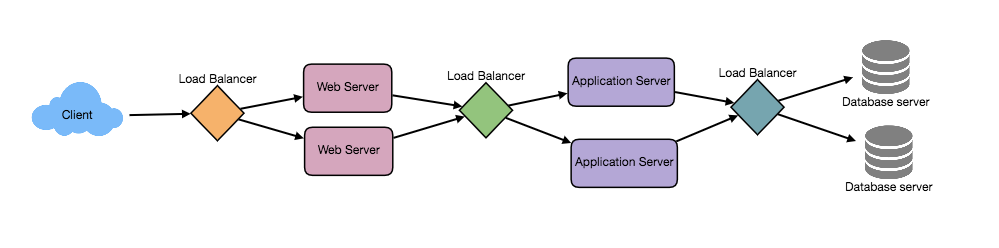

Load Balancer (LB) help to spread the traffic across a cluster of servers to improve responsiveness and availability of applications, websites or databases. Load needs to be balanced between user requests and your web servers, but must also be balanced at every stage to achieve full scalability and redundancy for your system.

## Load Balance Overview
Typically a load balancer sits between the client and the server accepting incoming network and application traffic and distributing the traffic across multiple backend servers using various algorithms. By balancing application requests across multiple servers, a load balancer reduces individual server load and prevents any one application server from becoming a single point of failure, thus improving overall application availability and responsiveness.

### Where Are They Applicable?
Load balancers can exist in different parts of the application architecture. Between a client request and the eventual database transaction, load balances can be placed in:

1. Between the user and the web server
2. Between web servers and an internal platform layer, like application servers or cache servers
3. Between internal platform layer and database

For each load balancer implemented there can be different benefits provided. The load balancer for client requests to the web server will operate differently than the load balancer between a microservice and the database. Since they support/improve different parts of the application, they can come in different flavors. Before we discuss the different load balancing algorithms, let's go over the benefits.

## High-Level Benefits
* Users experience faster, uninterrupted service. Users won’t have to wait for a single struggling server to finish its previous tasks. Instead, their requests are immediately passed on to a more readily available resource.
* Service providers experience less downtime and higher throughput. Even a full server failure won’t affect the end user experience as the load balancer will simply route around it to a healthy server.
* Load balancing makes it easier for system administrators to handle incoming requests while decreasing wait time for users.
* Smart load balancers provide benefits like predictive analytics that determine traffic bottlenecks before they happen. As a result, the smart load balancer gives an organization actionable insights. These are key to automation and can help drive business decisions.
* System administrators experience fewer failed or stressed components. Instead of a single device performing a lot of work, load balancing has several devices perform a little bit of work.

## Load Balancing Algorithms
There are several different types of load balancing algorithms that are applicable in different use cases. The most common are described below.

#### Least Connection Method
This method directs traffic to the server with the fewest active connections. This approach is quite useful when there are a large number of persistent client connections which are unevenly distributed between the servers

#### Least Response Time Method
This algorithm directs traffic to the server with the fewest active connections and lowest average response time.

#### Least Bandwidth Method
This method selects the server that is currently serving the least amount of traffic measured in Mbps

#### Round Robin Method
This method cycle through a list of server and sends each new request to the next server. It is most useful when the servers are of equal specification and there are not many persistent connections. 

#### Weighted Round Robin Method
The weighted round-robin scheduling is designed to better handle servers with different processing capacities. Each server is assigned a weight (an integer value that indicates the processing capacity). Servers with higher weights receive new connections before those with less weights and servers with higher weights get more connections than those with less weights.

#### IP Hash
Under this method, a hash of the IP address of the client is calculated to redirect the request to a server.

More on LB’s: [Load Balancing 101 - Learn All About Load Balancers](https://avinetworks.com/what-is-load-balancing/)