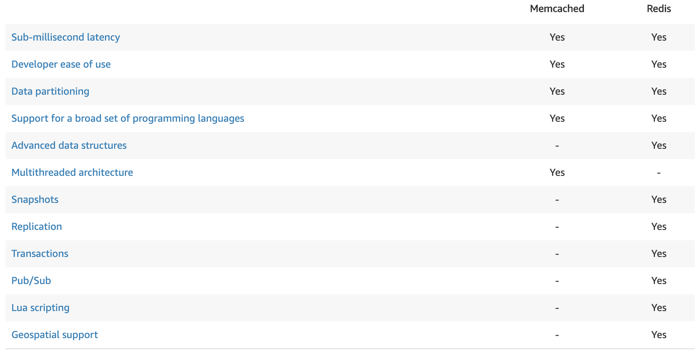

Redis and Memcached are popular, open-source, in-memory data stores. Although they are both easy to use and offer high performance, there are important differences to consider when choosing an engine. Memcached is designed for simplicity while Redis offers a rich set of features that make it effective for a wide range of use cases. Understand your requirements and what each engine offers to decide which solution better meets your needs.

### Sub-millisecond latency
Both Redis and Memcached support sub-millisecond response times. By storing data in-memory they can read data more quickly than disk based databases.

### Developer ease of use
Both Redis and Memcached are syntactically easy to use and require a minimal amount of code to integrate into your application.

### Data partitioning
Both Redis and Memcached allow you to distribute your data among multiple nodes. This allows you to scale out to better handle more data when demand grows.

### Support for a broad set of programming languages
Both Redis and Memcached have many open-source clients available for developers. Supported languages include Java, Python, PHP, C, C++, C#, JavaScript, Node.js, Ruby, Go and many others.

### Advanced data structures
In addition to strings, Redis supports lists, sets, sorted sets, hashes, bit arrays, and hyperloglogs. Applications can use these more advanced data structures to support a variety of use cases. For example, you can use Redis Sorted Sets to easily implement a game leaderboard that keeps a list of players sorted by their rank.

### Multithreaded architecture
Since Memcached is multithreaded, it can make use of multiple processing cores. This means that you can handle more operations by scaling up compute capacity.

### Snapshots
With Redis you can keep your data on disk with a point in time snapshot which can be used for archiving or recovery.

### Replication
Redis lets you create multiple replicas of a Redis primary. This allows you to scale database reads and to have highly available clusters.

### Transactions
Redis supports transactions which let you execute a group of commands as an isolated and atomic operation.

### Pub/Sub
Redis supports Pub/Sub messaging with pattern matching which you can use for high performance  [chat rooms](https://aws.amazon.com/blogs/database/how-to-build-a-chat-application-with-amazon-elasticache-for-redis/) , real-time comment streams, social media feeds, and server intercommunication.

### Lua scripting
Redis allows you to execute transactional Lua scripts. Scripts can help you boost performance and simplify your application.

### Geospatial support
Redis has purpose-built commands for working with real-time  [geospatial data](https://aws.amazon.com/blogs/database/amazon-elasticache-utilizing-redis-geospatial-capabilities/)  at scale. You can perform operations like finding the distance between two elements (for example people or places) and finding all elements within a given distance of a point.

## When to use Memcached
Memcached could be preferable when caching relatively small and static data, such as HTML code fragments. Memcached’s internal memory management, while not as sophisticated as that of Redis, is more efficient in the simplest use cases because it consumes comparatively less memory resources for metadata. Strings (the only data type supported by Memcached) are ideal for storing data that is only read, because strings require no further processing.

Large data sets often involve serialized data, which always requires more space to store. While Memcached is effectively limited to storing data in its serialized form, the data structures in Redis can store any aspect of the data natively, thus reducing serialization overhead.

The second scenario in which Memcached has an advantage over Redis is in scaling. Because Memcached is multithreaded, you can easily scale up by giving it more computational resources, but you will lose part or all of the cached data (depending on whether you use consistent hashing). Redis, which is mostly single-threaded, can scale horizontally via clustering without loss of data. Clustering is an effective scaling solution, but it is comparatively more complex to set up and operate.

## When to use Redis
With Redis as a cache, you gain a lot of power (such as the ability to fine-tune cache contents and durability) and greater efficiency overall. Once you use the data structures, the efficiency boost becomes tremendous for specific application scenarios.

Redis’ superiority is evident in almost every aspect of cache management. Caches employ a mechanism called data eviction to make room for new data by deleting old data from memory. Memcached’s data eviction mechanism employs a Least Recently Used algorithm and somewhat arbitrarily evicts data that’s similar in size to the new data.

Redis, by contrast, allows for fine-grained control over eviction, letting you choose from six different eviction policies. Redis also employs more sophisticated approaches to memory management and eviction candidate selection. Redis supports both lazy and active eviction, where data is evicted only when more space is needed or proactively. 
Redis gives you much greater flexibility regarding the objects you can cache. While Memcached limits key names to 250 bytes and works with plain strings only, Redis allows key names and values to be as large as 512MB each, and they are binary safe. Plus, Redis has five primary data structures to choose from, opening up a world of possibilities to the application developer through intelligent caching and manipulation of cached data.

- - - -

## Redis Use Cases

### Redis for data persistence
Using Redis data structures can simplify and optimize several tasks—not only while caching, but even when you want the data to be persistent and always available. For example, instead of storing objects as serialized strings, developers can use a Redis Hash to store an object’s fields and values, and manage them using a single key. Redis Hash saves developers the need to fetch the entire string, deserialize it, update a value, reserialize the object, and replace the entire string in the cache with its new value for every trivial update—that means lower resource consumption and increased performance.

Other data structures offered by Redis (such as lists, sets, sorted sets, hyperloglogs, bitmaps, and geospatial indexes) can be used to implement even more complex scenarios. Sorted sets for time-series data ingestion and analysis is another example of a Redis data structure that offers enormously reduced complexity and lower bandwidth consumption.
Another important advantage of Redis is that the data it stores isn’t opaque, so the server can manipulate it directly. A considerable share of the 180-plus commands available in Redis are devoted to data processing operations and embedding logic in the data store itself via server-side Lua scripting. These built-in commands and user scripts give you the flexibility of handling data processing tasks directly in Redis without having to ship data across the network to another system for processing.

Redis offers optional and tunable data persistence designed to bootstrap the cache after a planned shutdown or an unplanned failure. While we tend to regard the data in caches as volatile and transient, persisting data to disk can be quite valuable in caching scenarios. Having the cache’s data available for loading immediately after restart allows for much shorter cache warm-up and removes the load involved in repopulating and recalculating cache contents from the primary data store.

### Redis In-memory Data Replication
Redis can also replicate the data that it manages. Replication can be used for implementing a highly available cache setup that can withstand failures and provide uninterrupted service to the application. A cache failure falls only slightly short of application failure in terms of the impact on user experience and application performance, so having a proven solution that guarantees the cache’s contents and service availability is a major advantage in most cases.

Last but not least, in terms of operational visibility, Redis provides a slew of metrics and a wealth of introspective commands with which to monitor and track usage and abnormal behavior. Real-time statistics about every aspect of the database, the display of all commands being executed, the listing and managing of client connections—Redis has all that and more.

When developers realize the effectiveness of Redis’s persistence and in-memory replication capabilities, they often use it as a first-responder database, usually to analyze and process high-velocity data and provide responses to the user while a secondary (often slower) database maintains a historical record of what happened. When used in this manner, Redis can also be ideal for analytics use cases.

### Redis for Data Analytics
Three analytics scenarios come immediately to mind. In the first scenario, when using something like Apache Spark to iteratively process large data sets, you can use Redis as a serving layer for data previously calculated by Spark. In the second scenario, using Redis as your shared, in-memory, distributed data store can  [accelerate Spark processing speeds by a factor of 45 to 100](http://www.infoworld.com/article/3045083/analytics/give-spark-a-45x-speed-boost-with-redis.html) . Finally, an all too common scenario is one in which reports and analytics need to be customizable by the user, but retrieving data from inherently batch data stores (like Hadoop or an RDBMS) takes too long. In this case, an in-memory data structure store such as Redis is the only practical way of getting sub-millisecond paging and response times.

When using extremely large operational data sets or analytics workloads, running everything in-memory might not be cost effective. To achieve sub-millisecond performance at lower cost, Redis Labs created a  [version of Redis](https://redislabs.com/rlec-flash)  that runs on a combination of RAM and flash, with the option to configure RAM-to-flash ratios. While this opens up several new avenues to accelerate workload processing, it also gives developers the option to simply run their “cache on flash.”

Open source software continues to provide some of the best technologies available today. When it comes to boosting application performance through caching, Redis and Memcached are the most established and production-proven candidates. However, given Redis’s richer functionality, more advanced design, many potential uses, and greater cost efficiency at scale, Redis should be your first choice in nearly every case.

